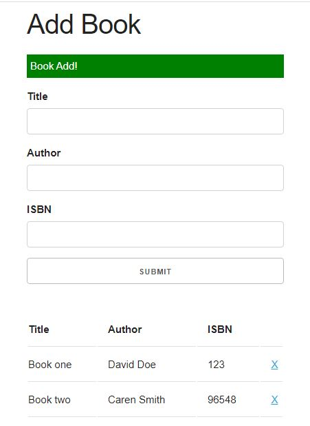
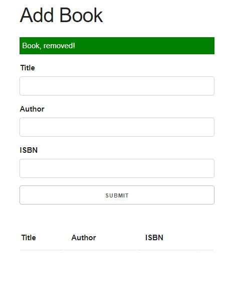
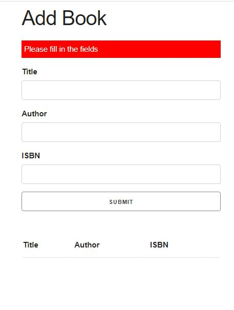

## Welcome! 👋

- Build a book list with VanillaJS during the javascript course.
- Exercise about classes and storing data in localStorage.

### Screenshot

### Screenshot

### Screenshot

### Links

- Live Site URL: [github-pages](https://rottini.github.io/book-list/)

## Author

- Website - [Rafael](https://github.com/rottini)
[project](https://github.com/rottini/book-list)
